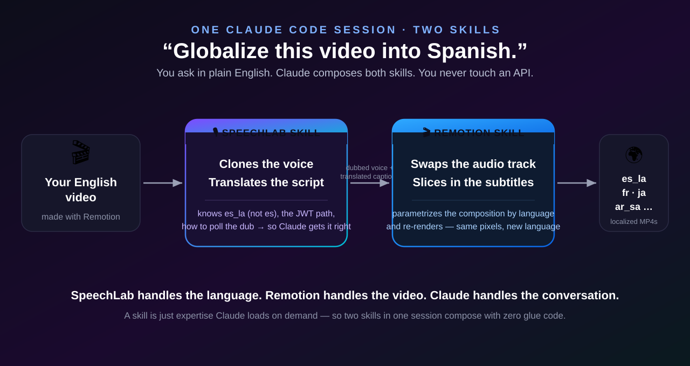
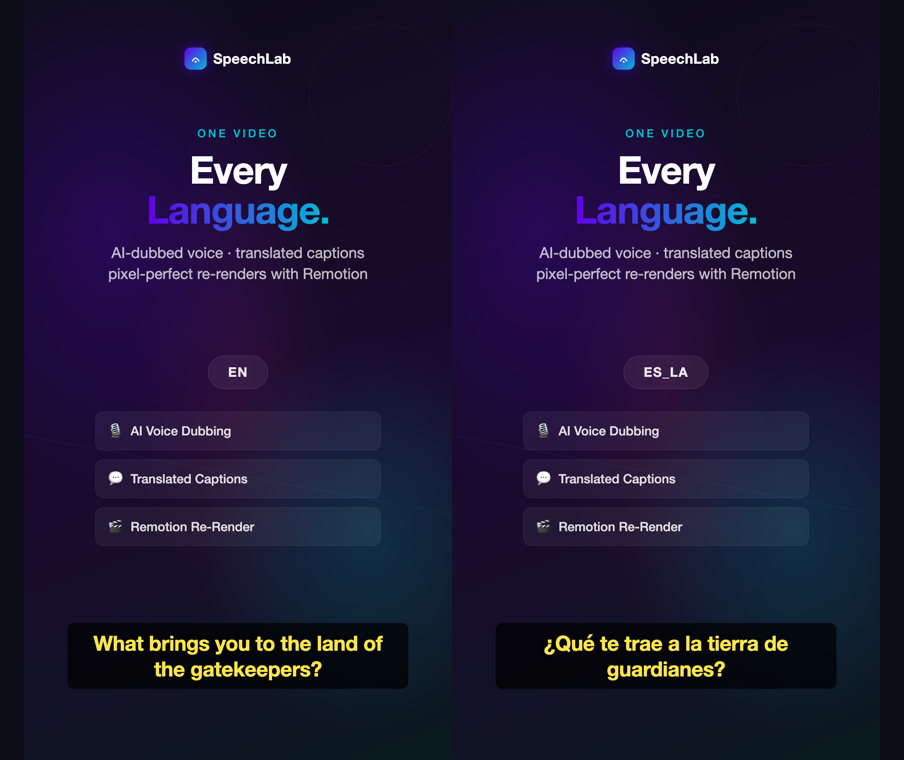
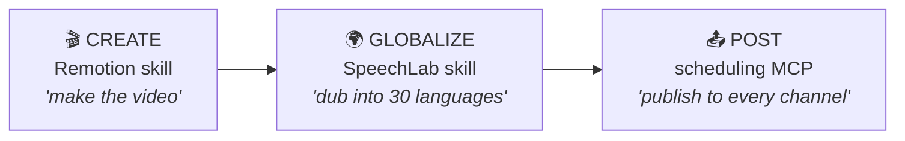

# Make a video with Claude. Reach the whole planet — in one more sentence.

[Sabrina Ramonov showed how Claude Code + the Remotion skill turns a prompt into a finished short-form video](https://www.sabrina.dev/p/claude-just-changed-content-creation-remotion-video) — no editor, no timeline, just a conversation. It's the new content pipeline: **you describe, the agent makes.**

But every video it makes is in English. **~3 of 4 people on Earth don't speak English**, and native-language video wins on every platform's algorithm. So you make something great and then wall off 75% of your audience.

Here's the missing half. Add **one more skill** — the **SpeechLab skill** — to the same Claude Code session, and your video goes global by *asking*. No dashboard, no API, no re-records.

---

## How the two skills play together



That's the whole idea, and the division of labor is clean:

- **The SpeechLab skill owns the language.** It clones your speaker's voice and translates the script — so the Spanish version sounds like *you* speaking Spanish, not a robot. It also carries the hard-won API know-how (the right locale code is `es_la`, not `es`; where the auth token lives; how to poll the dub) so Claude gets it right the first time.
- **The Remotion skill owns the video.** It takes the dubbed audio and translated captions, swaps the audio track, **slices the new subtitles into the composition**, and re-renders — same pixels, new language.
- **Claude owns the conversation.** It already has both skills loaded, so it just orchestrates them. No glue code, no integration layer. *That's the point of skills.*

> **"But how does Claude even know to use Remotion?"** Because the Remotion skill is loaded in the session and recognizes your Remotion project — it knows the composition lives in `src/`, that it renders with `npx remotion render`, that compositions can be parametrized. A skill is just expertise Claude reads on demand. Two skills in one session = Claude is fluent in *both* halves of the problem, and composes them itself.

---

## The result is real

We ran it end to end. Same promo, authored once in English, re-rendered into Latin-American Spanish — **identical layout, the speaker's own voice dubbed, the captions Remotion sliced in are translated:**



The only things that changed are the voice (audible) and the subtitle (visible). Everything else — motion, layout, branding — is byte-for-byte the same render.

---

## The session

You're continuing right where Sabrina left off — a finished 9:16 promo in English. You type one line:

> **You:** Globalize this into Spanish, then French, Portuguese, Japanese, and Arabic — same voice, translated captions. Re-render each.

> **Claude:** Dubbing your narration into all five (voice-cloned), pulling the translated captions, and re-rendering one localized cut per language…
>
> ✅ Done — `out/promo-es_la.mp4`, `promo-fr.mp4`, `promo-pt_br.mp4`, `promo-ja.mp4`, `promo-ar_sa.mp4`. One English source → five markets. (Arabic captions render right-to-left automatically.)

You wrote no code and never opened an API.

---

## Why you'd do this

- **10× your reachable audience** — English + 5 languages puts you in front of billions more people, in the language they actually watch in.
- **More views, free** — localized video lifts completion and shares on every platform. Same content, multiplied.
- **Your voice everywhere** — cloning keeps your identity across languages. Brand-safe, creator-safe.
- **Zero extra production** — no vendors, no re-records. It's one more sentence in a chat you were already having.

---

## It's a stage in the whole agentic content flywheel



Idea → finished video → 30 localized versions → posted everywhere, all from one Claude Code session. Each step is a skill or MCP Claude already knows how to drive. You supply the intent; the skills supply the expertise.

---

## Get started

```bash
# 1. The Remotion skill (make videos) — Sabrina's starting point
npx skills add remotion-dev/skills

# 2. The SpeechLab skill (globalize them)
claude plugin marketplace add speechlabinc/speechlab-platform-skill
claude plugin install speechlab-api
```

Then, in a Claude Code session with a Remotion video open:

> *"Globalize this into Spanish and re-render."*  → then →  *"Now five more languages."*

A runnable version of the exact project above — it renders an English **and** a Latin-American Spanish cut from real SpeechLab dubbed audio — lives in [`examples/remotion-globalization`](../examples/remotion-globalization).

- **SpeechLab skill:** https://github.com/speechlabinc/speechlab-platform-skill
- **SpeechLab MCP server** (`npx speechlab-mcp`, for tool-based agents): https://github.com/speechlabinc/speechlab-mcp
- **Remotion skill:** https://github.com/remotion-dev/remotion/tree/main/packages/skills/skills/remotion

Make it once. Reach everyone.
