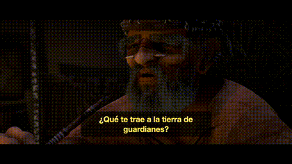

# Globalizing a video inside a Claude Code session

[Sabrina Ramonov showed how Claude Code + the Remotion skill makes a video from a prompt.](https://www.sabrina.dev/p/claude-just-changed-content-creation-remotion-video) This is the same thing, one step later: I handed Claude that finished English video and asked it to make a Spanish one — dub the voice, overlay the translated subtitles, render it. All in the session. Here's exactly what happened.

The result it produced (Latin-American Spanish, the speaker's own voice dubbed, translated subtitle overlaid by Remotion):



▶️ **Full video:** [`docs/videos/promo-es_la.mp4`](videos/promo-es_la.mp4) · **The project:** [`examples/remotion-globalization`](../examples/remotion-globalization)

---

## The session

> **Me:** Open `examples/remotion-globalization` — it's a Remotion promo in English. Make a Latin-American Spanish version: dub the narration into Spanish in the same voice, overlay the translated subtitles, and render it.

> **Claude:** This is a Remotion project (composition `Main` in `src/Root.tsx`). I'll use the SpeechLab skill to dub the English narration into Latin-American Spanish, then have Remotion swap the audio and overlay the translated captions. Submitting the dub now…
>
> *Created the dub (`en` → `es_la`). Polling the job…*
>
> ```
> transcription: COMPLETE → translation: COMPLETE → dub mergeStatus: COMPLETE  (≈5 min)
> ```
>
> Dub finished. I downloaded the Spanish audio and the translated, time-aligned captions into `public/es_la/`. Rendering the localized cut:
>
> ```
> npx remotion render Main out/promo-es_la.mp4 --props='{"language":"es_la"}'
> ```
>
> ✅ **`out/promo-es_la.mp4`** — 43s, 1080×1920, the same promo with the Spanish dub and Spanish subtitles. Want me to do more languages?

> **Me:** Yes — French, Brazilian Portuguese, Japanese, and Arabic too.

> **Claude:** Dubbing into `fr`, `pt_br`, `ja`, and `ar_sa`, then rendering each. (Arabic subtitles render right-to-left automatically.)
>
> ✅ `promo-fr.mp4`, `promo-pt_br.mp4`, `promo-ja.mp4`, `promo-ar_sa.mp4` — one English source, five languages.

That's the whole demo. I never opened the SpeechLab API or wrote a line of dubbing code. Claude had two skills in the session — **Remotion** (it knows how to open and render the project) and **SpeechLab** (it knows how to dub and translate) — and just used both.

---

## Run it yourself

```bash
# the two skills, in one Claude Code session
npx skills add remotion-dev/skills                                   # make/render videos
claude plugin marketplace add speechlabinc/speechlab-platform-skill  # globalize them
claude plugin install speechlab-api
```

Then point Claude at a Remotion project and say:

> *"Make a Spanish version of this — dub the voice and overlay the subtitles — and render it."*

The exact project from this session, ready to clone and run: **[`examples/remotion-globalization`](../examples/remotion-globalization)**.

- SpeechLab skill: https://github.com/speechlabinc/speechlab-platform-skill
- SpeechLab MCP server (`npx speechlab-mcp`): https://github.com/speechlabinc/speechlab-mcp
- Remotion skill: https://github.com/remotion-dev/remotion/tree/main/packages/skills/skills/remotion
